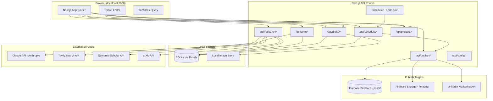

# Architecture — Research Writing Assistant

> Last updated: 2026-03-11 (rev 5 — Phase 3 Writing) | Updated by: Claude Code

## System Overview

Research Writing Assistant is a personal web application that automates the end-to-end content pipeline: researching topics from web and academic sources, writing AI-assisted drafts for LinkedIn and blog posts, and publishing on a schedule. It runs locally (Next.js on localhost), stores all work-in-progress in SQLite, and publishes approved content to an existing Firebase blog and LinkedIn.

## Architecture Diagram



## Data Architecture — Two-Zone Model

All work-in-progress stays local. Firebase and LinkedIn are only touched at publish time.

```
┌─────────────────────────────────────────────────────────────────┐
│                    LOCAL ZONE (SQLite + filesystem)              │
│                                                                 │
│  projects ──→ research_items ──→ drafts ──→ schedules           │
│                    ↕                ↕                            │
│                  tags          draft_versions                    │
│                                                                 │
│  app_config (ban lists, LinkedIn tokens, settings)              │
└───────────────────────────────────────┬─────────────────────────┘
                                        │ PUBLISH GATE
                                        │ (human-approved only)
                    ┌───────────────────┼───────────────────┐
                    ▼                                       ▼
          Firebase Firestore                        LinkedIn API
          posts/ collection                         Posts endpoint
          /images/ storage                          Assets endpoint
```

## Component Map

| Component | Location | Responsibility | Dependencies |
|-----------|----------|----------------|--------------|
| Research Workspace | `src/features/research/` | Search, URL ingestion, academic search, research library | Tavily, Semantic Scholar, arXiv, Claude API |
| Writing Editor | `src/features/writing/` | TipTap editor, 3 AI writing modes, anti-slop review, platform preview | Claude API, TipTap |
| Publishing | `src/features/publishing/` | Firebase blog publish, LinkedIn publish, scheduling | Firebase Admin SDK, LinkedIn API, node-cron |
| Content Management | `src/features/content-management/` | Projects, draft lists, status tracking, search | SQLite |
| AI Client | `src/shared/lib/ai-client.ts` | Claude API wrapper: summarization, streaming content generation, non-streaming generation, anti-slop review | Anthropic SDK |
| SSE Utils | `src/shared/lib/sse-utils.ts` | Server-Sent Events response helper with keepalive (15s) and abort detection | — |
| Firebase Service | `src/shared/lib/firebase-admin.ts` | Blog publishing, image upload to Firebase Storage | Firebase Admin SDK |
| LinkedIn Service | `src/shared/lib/linkedin-client.ts` | OAuth 2.0 flow, post creation, image upload | LinkedIn Marketing API |
| Tavily Client | `src/shared/lib/tavily-client.ts` | Web search with AI-ready cleaned results | Tavily API |
| Academic Client | `src/shared/lib/academic-client.ts` | Paper search across Semantic Scholar + arXiv | Semantic Scholar, arXiv APIs |
| Prompt Templates | `src/shared/lib/prompts/` | Modular prompt composition for all writing modes | — |
| Scheduler | `src/shared/lib/scheduler.ts` | node-cron polling for due scheduled posts | node-cron, SQLite |
| Logger | `src/shared/lib/logger.ts` | Structured JSON logging with feature tags | — |
| DB Client | `src/shared/lib/db.ts` | Drizzle ORM client for SQLite | Drizzle, better-sqlite3 |
| Content Validator | `src/shared/lib/validate-content.ts` | XSS defense-in-depth validation for blog content | — |

## Data Model

### Core Entities

| Entity | Storage | Key Fields | Relationships |
|--------|---------|------------|---------------|
| Project | SQLite `projects` | id, name, description, status, createdAt | Has many ResearchItems, Has many Drafts |
| ResearchItem | SQLite `research_items` | id, projectId, sourceType, title, url, content, summary, reliabilityTier | Belongs to Project, Has many Tags (M:M) |
| Tag | SQLite `tags` | id, name | Has many ResearchItems (M:M) |
| Draft | SQLite `drafts` | id, projectId, status, linkedinContent, blogTitle, blogContent, blogExcerpt, coverImagePath, writingMode, antiSlopScore | Belongs to Project, Has many Versions, Has many ResearchItems (M:M), Has many Schedules |
| DraftVersion | SQLite `draft_versions` | id, draftId, versionNumber, linkedinContent, blogContent, changeNote | Belongs to Draft |
| Schedule | SQLite `schedules` | id, draftId, platform, scheduledAt, status, publishAttempts, lastAttemptAt, publishedUrl, errorMessage | Belongs to Draft |
| AiUsage | SQLite `ai_usage` | id, feature, operation, model, promptTokens, completionTokens, estimatedCostUsd, durationMs | — |
| AppConfig | SQLite `app_config` | key, value (JSON) | — |

### Schema (Drizzle ORM)

```typescript
// src/db/schema.ts
import { sqliteTable, text, integer, real } from 'drizzle-orm/sqlite-core';

export const projects = sqliteTable('projects', {
  id: text('id').primaryKey(),
  name: text('name').notNull(),
  description: text('description'),
  status: text('status', { enum: ['active', 'archived'] }).default('active'),
  createdAt: integer('created_at', { mode: 'timestamp' }).notNull(),
  updatedAt: integer('updated_at', { mode: 'timestamp' }).notNull(),
});

export const researchItems = sqliteTable('research_items', {
  id: text('id').primaryKey(),
  projectId: text('project_id').references(() => projects.id, { onDelete: 'cascade' }),
  sourceType: text('source_type', { enum: ['web', 'url', 'academic'] }).notNull(),
  title: text('title').notNull(),
  url: text('url'),
  content: text('content'),
  summary: text('summary'),
  authors: text('authors'),              // JSON array string
  publishedDate: text('published_date'),
  reliabilityTier: text('reliability_tier', {
    enum: ['academic', 'industry_report', 'reputable_publication', 'blog_opinion', 'unknown']
  }),
  metadata: text('metadata'),            // JSON string
  createdAt: integer('created_at', { mode: 'timestamp' }).notNull(),
});

export const tags = sqliteTable('tags', {
  id: text('id').primaryKey(),
  name: text('name').notNull().unique(),
});

export const researchItemTags = sqliteTable('research_item_tags', {
  researchItemId: text('research_item_id').references(() => researchItems.id, { onDelete: 'cascade' }),
  tagId: text('tag_id').references(() => tags.id, { onDelete: 'cascade' }),
});

export const drafts = sqliteTable('drafts', {
  id: text('id').primaryKey(),
  projectId: text('project_id').references(() => projects.id, { onDelete: 'cascade' }),
  status: text('status', {
    enum: ['generating', 'draft', 'reviewing', 'approved', 'scheduled', 'published', 'failed']
  }).default('draft'),
  linkedinContent: text('linkedin_content'),
  blogTitle: text('blog_title'),
  blogContent: text('blog_content'),
  blogExcerpt: text('blog_excerpt'),
  coverImagePath: text('cover_image_path'),
  writingMode: text('writing_mode', { enum: ['full_draft', 'outline_expand', 'co_writing'] }),
  antiSlopScore: real('anti_slop_score'),
  antiSlopReport: text('anti_slop_report'),
  createdAt: integer('created_at', { mode: 'timestamp' }).notNull(),
  updatedAt: integer('updated_at', { mode: 'timestamp' }).notNull(),
});

export const draftVersions = sqliteTable('draft_versions', {
  id: text('id').primaryKey(),
  draftId: text('draft_id').references(() => drafts.id, { onDelete: 'cascade' }),
  versionNumber: integer('version_number').notNull(),
  linkedinContent: text('linkedin_content'),
  blogTitle: text('blog_title'),
  blogContent: text('blog_content'),
  blogExcerpt: text('blog_excerpt'),
  changeNote: text('change_note'),
  createdAt: integer('created_at', { mode: 'timestamp' }).notNull(),
});

export const draftResearchLinks = sqliteTable('draft_research_links', {
  draftId: text('draft_id').references(() => drafts.id, { onDelete: 'cascade' }),
  researchItemId: text('research_item_id').references(() => researchItems.id, { onDelete: 'cascade' }),
});

export const schedules = sqliteTable('schedules', {
  id: text('id').primaryKey(),
  draftId: text('draft_id').references(() => drafts.id, { onDelete: 'cascade' }),
  platform: text('platform', { enum: ['linkedin', 'blog', 'both'] }).notNull(),
  scheduledAt: integer('scheduled_at', { mode: 'timestamp' }).notNull(),
  status: text('status', {
    enum: ['pending', 'publishing', 'published', 'failed', 'cancelled']
  }).default('pending'),
  publishAttempts: integer('publish_attempts').default(0),
  lastAttemptAt: integer('last_attempt_at', { mode: 'timestamp' }),
  publishedUrl: text('published_url'),
  errorMessage: text('error_message'),
  createdAt: integer('created_at', { mode: 'timestamp' }).notNull(),
  publishedAt: integer('published_at', { mode: 'timestamp' }),
});

// ─── AI Usage Tracking ───
export const aiUsage = sqliteTable('ai_usage', {
  id: text('id').primaryKey(),
  feature: text('feature').notNull(),       // 'research', 'write', 'review', 'adapt'
  operation: text('operation'),              // 'draft', 'outline', 'co-write', 'summarize', etc.
  model: text('model').notNull(),
  promptTokens: integer('prompt_tokens'),
  completionTokens: integer('completion_tokens'),
  estimatedCostUsd: real('estimated_cost_usd'),
  durationMs: integer('duration_ms'),
  createdAt: integer('created_at', { mode: 'timestamp' }).notNull(),
});

export const appConfig = sqliteTable('app_config', {
  key: text('key').primaryKey(),
  value: text('value').notNull(),
  updatedAt: integer('updated_at', { mode: 'timestamp' }).notNull(),
});
```

### Database Migration Strategy

```bash
npm run db:generate   # Generate migration SQL from schema diff
npm run db:migrate    # Apply pending migrations to dev.db
npm run db:seed       # Seed default config (ban lists, settings)
npm run db:studio     # Open Drizzle Studio (visual DB browser)
```

Migration workflow:
1. Edit `src/db/schema.ts`
2. Run `npm run db:generate` — produces timestamped SQL in `src/db/migrations/`
3. Run `npm run db:migrate` — applies to `dev.db`
4. Migrations are committed to git for reproducibility

Drizzle config at `drizzle.config.ts`:
```typescript
import type { Config } from 'drizzle-kit';
export default {
  schema: './src/db/schema.ts',
  out: './src/db/migrations',
  dialect: 'sqlite',
  dbCredentials: { url: './dev.db' },
} satisfies Config;
```

**Backup:** Auto-backup `dev.db` daily to `backups/dev-{YYYY-MM-DD}.db` (keep last 7). Triggered by scheduler on first tick of each day.

### Schema Notes
- All IDs are nanoid strings (no auto-increment) for URL-friendliness
- Timestamps stored as Unix integers for SQLite compatibility
- JSON fields (authors, metadata, antiSlopReport) stored as serialized strings
- `coverImagePath` holds a local filesystem path during draft phase; after publish, updated to the Firebase Storage download URL
- `app_config` stores LinkedIn OAuth tokens (unencrypted — see Security section), vocabulary ban lists, and user preferences as JSON values

## API Endpoints

| Method | Path | Description | Auth | Request Body | Response |
|--------|------|-------------|------|-------------|----------|
| GET | `/api/projects` | List all projects | No | — | `Project[]` |
| POST | `/api/projects` | Create project | No | `{ name, description }` | `Project` |
| GET | `/api/projects/[id]` | Get project | No | — | `Project` with counts |
| PUT | `/api/projects/[id]` | Update project | No | Partial `Project` | `Project` |
| DELETE | `/api/projects/[id]` | Delete project (cascade) | No | — | `{ ok: true }` |
| GET | `/api/research` | List research items (filterable) | No | Query params | `ResearchItem[]` |
| POST | `/api/research` | Create research item | No | `ResearchItem` fields | `ResearchItem` |
| GET | `/api/research/[id]` | Get research item | No | — | `ResearchItem` |
| PUT | `/api/research/[id]` | Update research item | No | Partial fields | `ResearchItem` |
| DELETE | `/api/research/[id]` | Delete research item | No | — | `{ ok: true }` |
| POST | `/api/research/search` | Web search | No | `{ query, maxResults? }` | `SearchResult[]` |
| POST | `/api/research/scrape` | Scrape + summarize URL | No | `{ url }` | `{ title, content, summary }` |
| POST | `/api/research/academic` | Academic paper search | No | `{ query, sources? }` | `AcademicResult[]` |
| GET | `/api/drafts` | List drafts (filterable) | No | Query params | `Draft[]` |
| POST | `/api/drafts` | Create draft | No | `Draft` fields | `Draft` |
| GET | `/api/drafts/[id]` | Get draft with versions | No | — | `Draft` |
| PUT | `/api/drafts/[id]` | Update draft (creates version) | No | Partial fields | `Draft` |
| DELETE | `/api/drafts/[id]` | Delete draft | No | — | `{ ok: true }` |
| GET | `/api/drafts/[id]/versions` | List draft versions | No | — | `DraftVersion[]` |
| POST | `/api/write/draft` | Generate full draft | No | `{ projectId, researchItemIds, mode }` | `Draft` (streaming) |
| POST | `/api/write/outline` | Generate outline | No | `{ projectId, researchItemIds }` | `Outline` |
| POST | `/api/write/expand` | Expand outline section | No | `{ draftId, sectionIndex }` | `{ content }` (streaming) |
| POST | `/api/write/co-write` | Co-writing turn | No | `{ draftId, action, selection? }` | `{ content }` (streaming) |
| POST | `/api/write/adapt` | Adapt content between platforms | No | `{ draftId, from, to }` | `{ content }` |
| POST | `/api/write/review` | Anti-slop review | No | `{ draftId }` | `{ score, report, revised }` |
| POST | `/api/publish/blog` | Publish to Firebase blog | No | `{ draftId }` | `{ postId, url }` |
| POST | `/api/publish/linkedin` | Publish to LinkedIn | No | `{ draftId }` | `{ postUrl }` |
| GET | `/api/publish/linkedin/callback` | LinkedIn OAuth callback | No | Query params (code) | Redirect |
| GET | `/api/schedule` | List schedules | No | Query params | `Schedule[]` |
| POST | `/api/schedule` | Create schedule | No | `{ draftId, platform, scheduledAt }` | `Schedule` |
| GET | `/api/schedule/[id]` | Get schedule | No | — | `Schedule` |
| PUT | `/api/schedule/[id]` | Update schedule | No | Partial fields | `Schedule` |
| DELETE | `/api/schedule/[id]` | Cancel schedule | No | — | `{ ok: true }` |
| POST | `/api/schedule/cron` | Internal cron tick | Internal | — | `{ processed: number }` |
| GET | `/api/config` | Get all config | No | — | `Record<string, any>` |
| PUT | `/api/config` | Update config | No | `{ key, value }` | `{ ok: true }` |

Auth is "No" for all endpoints because this is a single-user local app with no authentication layer.

## External Integrations

| Service | Purpose | Config | Rate Limits | Error Handling |
|---------|---------|--------|-------------|----------------|
| Claude API (Anthropic) | AI writing: drafts, outlines, co-writing, adaptation, anti-slop review, URL summarization | `ANTHROPIC_API_KEY` in `.env.local` | Tier-dependent | Retry 3x with exponential backoff; log errors with `[ai]` tag |
| Tavily Search API | Web search returning AI-ready cleaned content | `TAVILY_API_KEY` in `.env.local` | 1,000 free/month | Retry 2x; fallback error message to user |
| Semantic Scholar API | Academic paper search (free, no key needed) | None | 100 req/5min (unauthenticated) | Retry with backoff; rate limit aware |
| arXiv API | Academic paper search and metadata | None | Be polite (3s delay between requests) | Retry 2x; XML parsing with fallback |
| Firebase Admin SDK | Publish blog posts to Firestore `posts/` collection, upload images to Storage `/images/` | `FIREBASE_SERVICE_ACCOUNT_KEY` (JSON) in `.env.local` | Firestore: 10k writes/sec | Validate XSS rules pre-write; log with `[publish]` tag |
| LinkedIn Marketing API | Post creation (text + image), OAuth 2.0 token management | `LINKEDIN_CLIENT_ID`, `LINKEDIN_CLIENT_SECRET` in `.env.local`; OAuth token in SQLite `app_config` | 100 posts/day | Refresh token if expired; retry 2x; log with `[linkedin]` tag |
| OpenAI Embeddings | Semantic search across research library (future) | `OPENAI_API_KEY` in `.env.local` | Tier-dependent | Retry 3x with backoff |

## Prompt Architecture

Prompts are composed modularly at runtime from `src/shared/lib/prompts/`:

```
FINAL_PROMPT = SYSTEM_BASE
             + ANTI_SLOP_RULES
             + VOCABULARY_BAN_LIST
             + CONTENT_TYPE_TEMPLATE   (linkedin-post | blog-post | outline | co-write | adaptation)
             + RESEARCH_CONTEXT        (injected from selected research items)
             + USER_INSTRUCTIONS       (optional per-request overrides)
```

| File | Purpose | Temperature |
|------|---------|-------------|
| `system-base.ts` | Identity, quality standards, core rules | — |
| `ban-list.ts` | Configurable vocabulary + phrase ban list | — |
| `linkedin-post.ts` | LinkedIn post generation (hook/context/value/proof/CTA) | 0.7-0.8 |
| `blog-post.ts` | Blog post generation (title/TL;DR/sections/sources) | 0.6-0.7 |
| `outline.ts` | Outline with thesis, sections, evidence mapping, gaps | 0.4-0.5 |
| `co-write.ts` | Continue, improve, suggest, transform modes | 0.7 |
| `adaptation.ts` | Blog↔LinkedIn content adaptation | 0.6 |
| `anti-slop-review.ts` | Quality score (0-100) + top 5 suggestions. Line-by-line rewrite is opt-in via UI. | 0.3 |

Full prompt templates and content guidelines: `docs/requirements/content-guidelines-and-prompt-templates.md`

## Scheduling Architecture

```
┌──────────────────────────────────────────────┐
│  instrumentation.ts (Next.js app boot)       │
│  └── Starts node-cron: "* * * * *" (60s)     │
│                                              │
│  next.config.js requirement:                 │
│    experimental: { instrumentationHook: true }│
│                                              │
│  Fallback: `npm run scheduler` (standalone)  │
└──────────────────┬───────────────────────────┘
                   ▼
┌──────────────────────────────────────────────┐
│  scheduler.ts tick()                          │
│                                              │
│  1. Recover stuck jobs:                       │
│     UPDATE status='pending'                   │
│     WHERE status='publishing'                 │
│     AND lastAttemptAt < NOW - 5min            │
│                                              │
│  2. Query due jobs:                           │
│     SELECT * FROM schedules                   │
│     WHERE scheduledAt <= NOW                  │
│     AND (status='pending'                     │
│          OR (status='failed'                  │
│              AND publishAttempts < 3          │
│              AND lastAttemptAt < NOW - 5min)) │
│                                              │
│  3. For each due job:                         │
│     a. Set status='publishing'               │
│     b. Increment publishAttempts              │
│     c. Set lastAttemptAt=NOW                  │
│     d. Call publish service                   │
│     e. On success:                            │
│        status='published', publishedAt=NOW    │
│     f. On failure:                            │
│        if attempts >= 3: status='failed'      │
│        else: status='failed' (will retry)     │
│        Store errorMessage                     │
│  4. Update parent draft status accordingly    │
└──────────────────────────────────────────────┘
```

- **SQLite is source of truth** — schedules survive server restarts
- **node-cron only polls** — never stores state in memory
- **Stuck job recovery:** Jobs stuck in `publishing` for >5 min are reset to `pending` (handles server crashes mid-publish)
- **Retry with backoff:** Failed jobs retry up to 3 times with 5-minute minimum gap between attempts
- **No overlapping ticks:** Scheduler uses a mutex flag to prevent concurrent tick() execution
- **Manual retry:** Users can manually retry failed publishes from the dashboard UI
- **Fallback startup:** If Next.js instrumentation hook is unavailable, run scheduler as standalone process via `npm run scheduler`

## Draft Status Lifecycle

```
generating → draft → reviewing → approved → scheduled → published
                                    ↓                      ↓
                                  failed                 failed
```

| Status | Meaning |
|--------|---------|
| `generating` | AI is currently generating content |
| `draft` | Content generated, available for editing |
| `reviewing` | Anti-slop review in progress |
| `approved` | User has approved, ready to schedule |
| `scheduled` | Publish job queued with date/time |
| `published` | Successfully published to target platform(s) |
| `failed` | Publish attempt failed (error message stored) |

## Version History Policy

Draft versions are auto-created at these trigger points:
- **Before AI regeneration** (user clicks "Regenerate" or changes writing mode)
- **Before anti-slop review** applies changes (preserves pre-review state)
- **On explicit user action** ("Save Version" button click — requires a `changeNote`)

Limits: Keep the 20 most recent versions per draft. Older versions are pruned automatically.

## Anti-Slop Review — Scoring Mode

The anti-slop review runs automatically after draft generation but surfaces results lightly:

```
Score: 82/100

Top suggestions:
1. Line 3: "robust framework" → "a framework that handles X" [banned word]
2. Line 7: Three sentences same length → vary rhythm
3. Line 12: "Companies are adopting AI" → needs specific example [NEEDS SPECIFICITY]
```

- **Score 90+:** Clean — no action needed
- **Score 70-89:** Good — minor suggestions shown, user can dismiss or apply
- **Score <70:** Needs work — suggestions shown prominently, user can trigger full rewrite

Full line-by-line rewrite is **opt-in** via "Deep Review" button in the UI.

## AI Cost Tracking

Every Claude API call logs to the `ai_usage` table:
- Feature tag, operation type, model used
- Prompt tokens, completion tokens, estimated cost (USD)
- Duration in milliseconds

Visible in Settings page as:
- Monthly spend estimate
- Usage breakdown by feature (research summarization, draft generation, review, adaptation)
- Budget warning thresholds (configurable)

## Frontend Pages

| Route | Page | Key Components |
|-------|------|----------------|
| `/` | Dashboard | Recent projects, drafts in progress, upcoming schedules |
| `/projects` | Project List | project-list, project-card |
| `/projects/[id]` | Project Detail | Research count, draft count, quick actions |
| `/projects/[id]/research` | Research Workspace | search-panel, url-input, research-library, research-card |
| `/projects/[id]/write` | Writing Editor | writing-workspace, tiptap-editor, editor-toolbar, mode-selector, content-type-selector, research-selector, platform-preview, anti-slop-report, co-write-panel, outline-panel, cover-image-upload, character-counter |
| `/projects/[id]/publish` | Publishing | post-preview, schedule-picker, publish-status |
| `/schedule` | Schedule Dashboard | Global schedule view, status filters |
| `/settings` | Settings | Ban list editor, API key status, LinkedIn connect, AI usage/cost dashboard |

## Tech Stack

| Layer | Technology | Version |
|-------|-----------|---------|
| Framework | Next.js (App Router) | 14.x |
| Language | TypeScript (strict mode) | 5.x |
| Styling | Tailwind CSS | 3.x |
| UI Components | shadcn/ui | Latest |
| Rich Text Editor | TipTap | 2.x |
| State Management | TanStack Query | 5.x |
| Icons | Lucide React | Latest |
| ORM | Drizzle ORM | Latest |
| Database | SQLite via better-sqlite3 | — |
| AI | Anthropic SDK (@anthropic-ai/sdk) | Latest |
| Web Search | Tavily JS SDK | Latest |
| Firebase | firebase-admin (server-side) | 12.x |
| LinkedIn | REST API (custom client) | v2 |
| Scheduling | node-cron | 3.x |
| ID Generation | nanoid | 5.x |
| Validation | zod | 3.x |

## Feature Log

| Feature | Date | Key Decisions | Files Changed |
|---------|------|---------------|---------------|
| PRD & Requirements | 2026-03-10 | Defined core workflow, Firebase schema, content guidelines | `docs/requirements/PRD.md`, `docs/requirements/content-guidelines-and-prompt-templates.md` |
| Architecture Design | 2026-03-10 | Chose Drizzle, TipTap, Tavily, two-zone data model | `ARCHITECTURE.md`, `docs/decisions/001-004` |
| Architecture Review | 2026-03-10 | Added retry logic, AI cost tracking, SSE protocol, image lifecycle, version policy, auth clarification | `ARCHITECTURE.md`, `docs/requirements/PRD.md` |
| Phase 1: Foundation | 2026-03-10 | Next.js 14 scaffold, Drizzle+SQLite (10 tables), structured logger, Project CRUD API, app shell with sidebar, shadcn/ui, TanStack Query, Tailwind v4 | `src/db/schema.ts`, `src/shared/lib/*`, `src/app/api/projects/*`, `src/features/content-management/*`, `src/shared/components/layout/*`, `src/app/**/*` |
| Phase 2: Research | 2026-03-11 | Tavily web search, Semantic Scholar + arXiv academic search, Claude API URL summarization with AI usage tracking, Research CRUD with tag management (find-or-create), 8 API routes, Research Workspace UI (search panel, URL import, research library), 52 new tests (97 total) | `src/shared/lib/tavily-client.ts`, `src/shared/lib/academic-client.ts`, `src/shared/lib/ai-client.ts`, `src/app/api/research/**/*`, `src/features/research/**/*` |
| Phase 3: Writing | 2026-03-11 | Modular prompt templates (11 files in `src/shared/lib/prompts/`), AI client extension (streaming + non-streaming + review), SSE response utility with keepalive, Draft CRUD API (4 routes), 6 Writing API routes (3 SSE streaming: draft/expand/co-write; 3 non-streaming: outline/adapt/review), Writing feature services + 12 TanStack Query hooks (including 3 streaming hooks with AbortController + 5min timeout), TipTap rich text editor (minimal mode for LinkedIn, full StarterKit for blog), Writing Workspace UI (mode selector, content type toggle, research selector, platform preview, anti-slop report, co-write panel, outline panel, cover image upload with magic bytes validation), Zod validation for all inputs, token estimation pre-flight checks, auto-save debounced at 5s (disabled during streaming), version pruning beyond 20. 128 new tests (225 total). | `src/shared/lib/prompts/**/*`, `src/shared/lib/ai-client.ts`, `src/shared/lib/sse-utils.ts`, `src/app/api/drafts/**/*`, `src/app/api/write/**/*`, `src/features/writing/**/*` |

## Error Handling Strategy

### Approach
- All errors caught and logged using structured logger (`src/shared/lib/logger.ts`)
- Every log entry includes: `level`, `feature`, `message`, `timestamp`, and optional `context`
- API routes return consistent error responses:
  ```json
  {
    "error": {
      "code": "RESOURCE_NOT_FOUND",
      "message": "Human-readable description"
    }
  }
  ```

### Error Flow
```
Client Error    → Error Boundary → Logger → Toast notification
API Error       → try-catch → Logger → Consistent JSON error response
Service Error   → try-catch → Logger → Retry (if applicable) → Propagate up
AI Error        → try-catch → Logger → Retry 3x backoff → User notification
Publish Error   → try-catch → Logger → Set schedule status=failed → Dashboard alert
Streaming Error → SSE event:error → Logger → Save partial draft → User notification
```

### Streaming Response Protocol (SSE)

AI writing endpoints (`/api/write/draft`, `/api/write/expand`, `/api/write/co-write`) use Server-Sent Events:

```
event: chunk
data: {"content": "partial text..."}

event: chunk
data: {"content": "more text..."}

event: done
data: {"draftId": "abc123", "tokensUsed": 1520, "status": "complete"}

-- OR on failure --

event: error
data: {"code": "AI_TIMEOUT", "message": "Claude API timed out after 30s", "partial": true}
```

Client-side handling:
- On `event: done` → save draft, show success
- On `event: error` → save partial content with `status='generating'` (user can retry)
- On unexpected stream close (no `done` or `error`) → treat as error, show "incomplete draft" UI
- All streaming wrapped in server-side try-catch; errors always emit `event: error` before closing

### Monitoring
- Vercel function logs (when deployed)
- Local: structured JSON logs to stdout (filterable by feature tag)

## Security Considerations

### Authentication Model — No User Login

This is a single-user local app. **There is no user login, no session management, no auth middleware.**

- **Firebase publishing:** Uses Firebase Admin SDK with a service account JSON key stored in `.env.local`. The Admin SDK bypasses all Firestore security rules — the app IS the admin. No user-level Firebase Auth is involved.
- **LinkedIn publishing:** Uses OAuth 2.0. The user authorizes once via browser redirect, and the access/refresh tokens are stored in SQLite `app_config` (see Token Storage below).
- **API routes:** No auth checks. All endpoints are localhost-only and trusted.

### Token Storage — LinkedIn OAuth

LinkedIn OAuth tokens are stored **unencrypted** in the SQLite `app_config` table as JSON values. This is acceptable because:
- The app runs on localhost only — no network exposure
- The SQLite file lives on the user's local machine
- The user is responsible for machine-level security (disk encryption, login password)
- If the machine is compromised, the attacker already has access to `.env.local` anyway

If security requirements change (e.g., deploying to a shared server), migrate to OS keychain storage (e.g., `keytar` or platform keyring APIs).

### Secret Management
- All secrets stored in `.env.local` (never committed)
- `.env.example` maintained with placeholder values for all required keys
- Server-side secrets only accessed in API routes (never in client components)
- Pre-commit grep scan for leaked keys (see CLAUDE.md Rule 1)

### Required Environment Variables
```
ANTHROPIC_API_KEY=sk-ant-...
TAVILY_API_KEY=tvly-...
OPENAI_API_KEY=sk-...              # For future embeddings
FIREBASE_SERVICE_ACCOUNT_KEY={}    # JSON service account
LINKEDIN_CLIENT_ID=...
LINKEDIN_CLIENT_SECRET=...
LINKEDIN_REDIRECT_URI=http://localhost:3000/api/publish/linkedin/callback
```

### Input Validation
- All API request bodies validated with zod schemas
- Blog content validated with basic defense-in-depth check (reject `<script>`, `javascript:`, `onerror=`, `onclick=`) even though the blog renders as plain text with `whitespace-pre-wrap`
- URL inputs validated before scraping
- File uploads limited to 5MB images only (PNG, JPG, WebP)

### Cover Image Lifecycle

```
1. User uploads image via writing editor UI
   → Saved to `data/images/{draftId}/{filename}`
   → Draft.coverImagePath = local path

2. During draft phase:
   → Image served from local filesystem via API route
   → Displayed in platform preview

3. On publish (blog):
   a. Upload to Firebase Storage `/images/{year}/{month}/{filename}`
   b. Get download URL
   c. Write post to Firestore with imageUrl = download URL
   d. Update Draft.coverImagePath with Firebase URL (for reference)
   e. Local file retained for archive

4. On publish (LinkedIn):
   a. Upload via LinkedIn Assets API (registerUpload → upload binary)
   b. Include asset URN in post creation request

5. Cleanup: Local images older than 30 days with status='published'
   can be purged via Settings page (manual action)
```

### Deployment Security
- Local-first (localhost:3000) — no public exposure by default
- Optional Vercel deployment: environment variables set in dashboard
- HTTPS enforced when deployed
- Firebase security rules enforced server-side (existing Personal-Website rules)

## Implementation Phases

### Phase 1: Foundation (Week 1-2)
Next.js scaffold, Drizzle + SQLite, app shell, project CRUD, logger

### Phase 2: Research (Week 3-4)
Tavily search, URL scraping, academic search, research library UI

### Phase 3: Writing (Week 5-7)
Claude API client, all 3 writing modes, anti-slop review, TipTap editor, platform preview, content adaptation

### Phase 4: Publishing (Week 8-10)
Firebase publish, LinkedIn OAuth + publish, scheduling, publishing dashboard

---

_This document is maintained by Claude Code as part of the development workflow. See CLAUDE.md Rule 4 for update guidelines._
